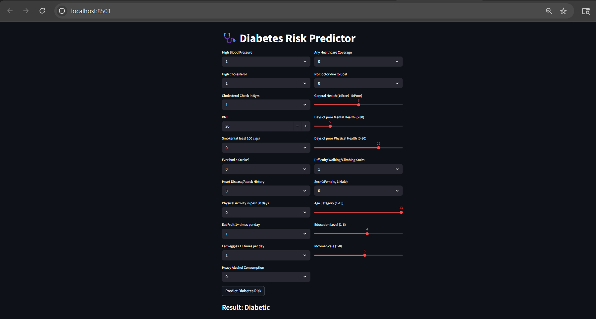

# Diabetes Risk Analysing Intelligence Engine

An end-to-end Machine Learning pipeline designed to predict diabetes risk levels (Healthy, Pre-diabetic, or Diabetic) using the CDC's BRFSS survey data. 

This project goes beyond simple accuracy—it focuses on **Medical Recall**, ensuring the model effectively identifies high-risk cases to act as an early-warning screening tool.

---

##  Project Overview
The goal was to move beyond binary "Yes/No" classification. By analyzing 21 health indicators (BMI, Blood Pressure, Physical Activity, etc.), this system categorizes individuals into three distinct risk tiers.

### Key Challenges & Solutions:
* **Handling Extreme Class Imbalance:** The original dataset was 84% "Healthy." I implemented undersampling to create a balanced 1:1:1 ratio, forcing the model to actually learn the specific features of pre-diabetes and diabetes. Resolved a critical **84% class skew** using strategic undersampling and outlier clipping.
* **Managing Data Noise:** Survey data is naturally "noisy." I cleaned and capped outliers in BMI and reported "poor health days" to prevent skewed results.
* **The "Pre-diabetes" Gray Area:** Identifying the transition state (Class 1) is a known challenge in medical ML. I benchmarked 5 different models to find the one with the best boundary-crossing logic.

---

## Model Benchmarking
I tested five different architectures to find the best balance between overall correctness and patient safety. 

| Model | Accuracy | Class 2 Recall (Diabetic) |
| :--- | :--- | :--- |
| **SVM** | **54%** | **0.64** |
| XGBoost | 53% | 0.62 |
| Logistic Regression | 54% | 0.59 |
| Random Forest | 52% | 0.56 |
| Decision Tree | 43% | 0.41 |

**Why SVM?** In a medical context, The SVM achieved the highest **Recall (0.64)**, making it the most effective tool for risk detection.

---

## Key Insights
* **Blood Pressure vs. BMI:** Feature importance analysis revealed that **High Blood Pressure** was a significantly stronger predictor of diabetes than BMI.
* **The Clinical Limit:** While 54% accuracy is lower than typical datasets, it represents a realistic ceiling for **self-reported survey data**. This suggests that while lifestyle-based ML is a powerful screening tool, clinical blood tests remain essential for confirming pre-diabetic states.
* **Deployment:** Inference engine serialized via Joblib for sub-second response times in the web UI.

---

##  Visualizing the Solution
Below is the deployed Streamlit application. Users can input health indicators (BMI, Blood Pressure, etc.) to receive an instant risk assessment.

---

## Tech Stack & Implementation
* **Language:** Python 3.10
* **Libraries:** Pandas, NumPy, Scikit-Learn, XGBoost, Joblib
* **Persistence:** Serialized models (using `joblib`) to create a reusable inference engine.
* **Deployment:** Integrated via **Streamlit** (managed in **VS Code**) for a user-facing health-risk calculator.

## Getting Started
1. Clone this repository.
2. Install dependencies: `pip install -r requirements.txt`.
3. Run the application: `streamlit run app.py`.

---
